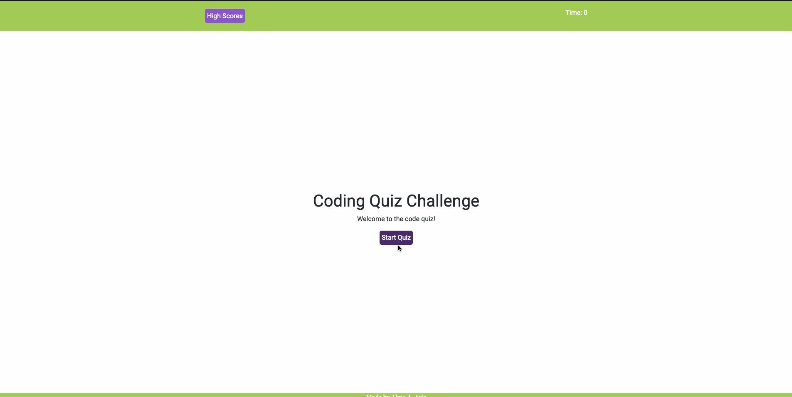

## JS Code Quiz
This is a timed coding quiz with multiple-choice questions.

## Installation 
   1. Download or clone repository
   2. Open the index.html in your browser to view webpage
   3. Use a text editor to view all code, or inspet the page with page inspector!

## Instructions

The home page will welcome the user  with a short message about the code quiz. When the user presses the start button, a timer will begin counting down from 75 seconds and the first question will appear. As they answer, score will be kept and a wrong answer will result in a 10 second time deduction. 
In the end, the user's score will be stored using local storage and added to a high scores page along with their initials. The user can clear the scores at any time or go back to the start of the quiz.

## Technologies Used
- HTML
- CSS
- Bootstrap
- Javascript/ JQuery

## Demo

## Link
please visit the deployed project at https://ayannaaziz.github.io/JS-Code-Quiz/